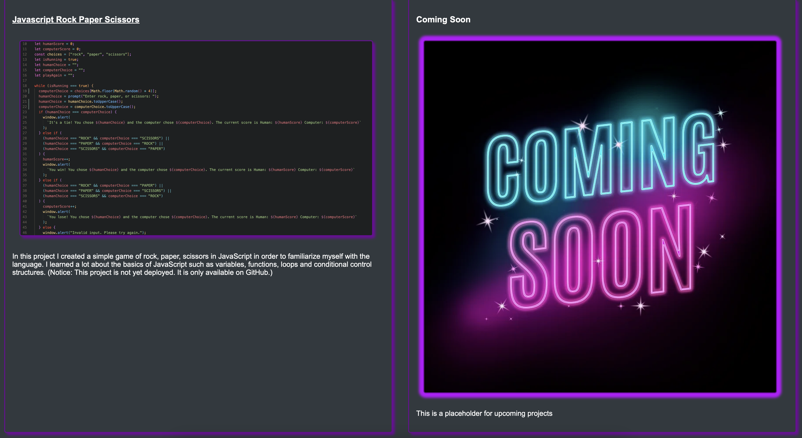

# professional-portfolio

## Description

This is the start of my professional portfolio that will grow with me as I become a better developer. At the moment it is comprised of basic HTML and some more advanced CSS.

- This was made to be able to apply my learning in my bootcamp and start to figure out how all the pieces fit together between HTML and CSS, along with practicing good version control through the use of Git/GitHub
- I made this so that I would be able to have a growing portfolio that I can take with me wherever I apply to and for networking to be able to demonstrate my skills
- I will now have a way to demonstrate my skills to any companies that I decide to apply to or for freelance work to show off my skills and a fron end developer.
- Though this was a bigger project and was complicated at times, I learned a lot about website layout, troubleshooting, advanced CSS techniques and how to learn on my own with the help of the resources around me

## Installation

- No installation is required, just visit the webpage at https://rhansen27.github.io/professional-portfolio/

## Usage

- Take a look around, and feel free to contact me as needed or offer suggestions for improvements!

```md
 
```

```md

```

## Credits

- Big thanks to StackOverflow.com and w3schools.com for the incredible references on how things work!
